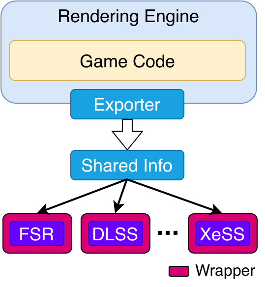

# TransparentSR: Decoupling Video Upscaling from Rendering for Cloud Gaming

## Overview of TransparentSR

TransparentSR is a library that enables decoupling video upscalers (aka super-resolution (SR) models) from game renderers, which allows utilizing various upscalers with games _without_ changing their source code.

The following figure presents a high-level illustration of TransparentSR.

<p align="center">
    
</p>

The details of TransparentSR are published in the following paper:

-   Deniz Ugur, Ihab Amer, and Mohamed Hefeeda, **Decoupling Video Upscaling from Rendering for Cloud Gaming**, In Proc. of ACM Multimedia Systems (MMSys'25) Conference, Stellenbosch, South Africa, March 2025.

The **abstract** of the paper is below:

Many recent video games require powerful hardware to render them. To reduce such high hardware requirements, upscalers have been proposed in the literature and industry. Upscalers save computing resources by first rendering games at lower resolutions and frame rates and then upscaling them to improve players’ quality of experience. Current upscalers, however, are tightly coupled with the rendering logic of video games, which requires updating the source code of each game for every upscaler. This increases the development cost and limits the use of upscalers. The tight coupling also stifles the deployment of upscalers in cloud gaming platforms to reduce the required computing resources. We propose decoupling upscalers from game renderers, which allows utilizing various upscalers with games without changing their source code. It also accelerates deploying upscalers in cloud gaming. Decoupling upscalers from renderers is, however, challenging because of the diversity of upscalers, their dependency on information at different rendering stages, and the strict timing requirements of video games. We present an efficient solution that addresses these challenges. We implement the proposed solution and demonstrate its effectiveness with two popular upscalers. We also develop a cloud gaming system in the emerging Media-over-QUIC (MoQ) protocol and implement the proposed approach with it. Our experiments show the potential savings in computing resources while meeting the strict timing constraints of video games.

## Implementation of TransparentSR

This repository started as a fork of the [FidelityFX SDK](https://github.com/GPUOpen-LibrariesAndSDKs/FidelityFX-SDK). Its main highlight is the [`TransparentSR`](framework/cauldron/framework/libs/tsr/) library, which manages the detachment of resources required for upscaling. It can be used with any upscaler, not just FSR or DLSS.

Although there are [many changes](https://github.com/GPUOpen-LibrariesAndSDKs/FidelityFX-SDK/compare/release-FSR3-3.0.4...DenizUgur:Detached-FSR-DLSS:fsr-dlss-remote) in this repository, most of them pertain to the Cauldron Framework. These changes introduce new APIs that provide the functionality needed for TransparentSR to operate.

To get started with TransparentSR, check out its source code in the [`framework/cauldron/framework/libs/tsr/`](framework/cauldron/framework/libs/tsr/) directory. Additionally, you can explore the sample render module that utilizes TransparentSR in the [`samples/fsr/tsrrendermodule.cpp`](samples/fsr/tsrrendermodule.cpp) file.

## Building and Testing Sample Upscalers

TransparentSR can easily support various video upscalers. To demonstrate its functionality, we have tested it with two of the most widely deployed upscalers: AMD FSR and NVIDIA DLSS.

This repository showcases a [sample](./samples/fsr/) that utilizes TransparentSR. It is possible to run the sample without detaching the upscaler as well.

### Prerequisites for building the sample

The sample must be compiled and run on a Windows machine. Make sure that you have installed your GPU's drivers and the following dependencies:

-   [Visual Studio 2022](https://visualstudio.microsoft.com/downloads/)
-   [Windows 10 SDK 10.0.19041.0](https://developer.microsoft.com/en-us/windows/downloads/windows-10-sdk)
-   [CMake 3.17](https://cmake.org/download/)

> In order to test DLSS 3 (Frame Generation), you need at least 40-series NVIDIA GPU.

To install the dependencies, you can follow two different approaches:

#### Using Chocolatey (recommended)

1. Install [Chocolatey](https://chocolatey.org/install) package manager.
2. Run the following commands to install the dependencies:

```bash
# For Visual Studio + Windows 10 SDK
choco install visualstudio2022community visualstudio2022-workload-nativedesktop -y
# For CMake
choco install cmake -y
```

#### Manually

1. Install [Visual Studio 2022](https://visualstudio.microsoft.com/downloads/).
2. Launch Visual Studio Installer and install the following components:
    - Desktop development with C++
    - Windows 10 SDK (10.0.19041.0)
3. Install [CMake 3.17](https://cmake.org/download/).

### How to build the sample

1. Clone the repository:

```bash
git clone https://github.com/DenizUgur/TransparentSR
cd TransparentSR
```

2. Generate the Visual Studio solution:

```bash
.\GenerateVisualStudioSolution.bat
```

This will generate a `build\` directory where you will find the solution for the SDK (`FidelityFX Native SDK.sln`). Launch the solution with Visual Studio and build the project using `ReleaseDX12` configuration.

Also be sure to download the media files using the following command:

```bash
.\UpdateMedia.bat
```

> More information about this script can be found [here](https://github.com/GPUOpen-LibrariesAndSDKs/FidelityFX-SDK/blob/release-FSR3-3.0.4/docs/tools/media-delivery.md).

### A note on the sample

Detaching the upscaler from the rendering process requires both process to be in sync. To account for scheduling issues and not to drop any rendered frames, both processes will wait for each other to fill/empty the resource pool. The resource pool is a static pool of 10 buffers. Each buffer has enough space for all the required resources for both FSR and DLSS to function.

> It is possible to optimize this aspect by using a dynamic resource pool. This will allow the upscaler to run at a different rate than the renderer. However, at this time this sample is no more than a proof of concept.

### Prerequisites for running the sample

The version numbers are the ones used during the development of the sample. It is possible to use newer versions of the software.

-   [Python](https://www.python.org/downloads/) (3.12.6)
-   [Node.js](https://nodejs.org/en/download/) (22.8.0) (for cloud gaming)
-   [Rust](https://www.rust-lang.org/tools/install) (1.81.0) (for cloud gaming)
-   [Go](https://go.dev/dl/) (1.23.1) (for cloud gaming)
-   [Clang](https://chocolatey.org/packages/llvm) (18.1.8) (for cloud gaming)
-   [FFmpeg](https://ffmpeg.org/download.html) (7.0.2) (for cloud gaming)

#### Installation with Chocolatey (recommended)

1. Install [Chocolatey](https://chocolatey.org/install).
2. Run the following commands to install the dependencies:

```bash
chocho install python nodejs rust go llvm ffmpeg -y
```

#### Install the Python dependencies

```bash
pip install -r requirements.txt
```

### How to run the sample

Since we deploy two seperate processes for the upscaling and rendering, it becomes difficult to run it within the Visual Studio IDE. We recommend building the solution and the use the helper CLI tool ([governor](./governor.py)) to run the sample.

1. Build the solution using the instructions above.
2. Run the sample using the following command:

```bash
# Display help
python governor.py -h

# Example usage
python governor.py --render-res 1285 835 --upscaler FSR3

# Example usage without detaching the upscaler
python governor.py --render-res 1285 835 --upscaler FSR3 --use-default

# Example usage if you want to launch the upscaler from Visual Studio
python governor.py --render-res 1285 835 --upscaler FSR3 --skip-upscaler # This will skip launching the upscaler
```

## Current Approaches for Integrating Upscalers with Video Games

Current approaches in the literature and industry require changing the source code of each game for every single upscaler, which is unlike TransparentSR, which reduces integration efforts and costs by transparently supporting various upscalers with minimal/no changes in the game source code.

For example, the following sites explain the detailed (and different) integration steps of two common upscalers:

-   [FSR (FidelityFX SDK)](https://github.com/GPUOpen-LibrariesAndSDKs/FidelityFX-SDK/blob/55ff22bb6981a9b9c087b9465101769fc0acd447/readme.md)
-   [DLSS (Streamline SDK)](https://github.com/NVIDIAGameWorks/Streamline/blob/c709dd9874e21dea100d6e2f2e109d16b87b8b55/README.md)

## Evaluation in Cloud Gaming

TransparentSR is evaluated in a cloud gaming system that is built on the emerging Media-over-QUIC (MoQ) protocol. The system uses the [Media-over-QUIC (MoQ)](https://datatracker.ietf.org/group/moq/about/) protocol for streaming the upscaled content. The sample and the governor script can be configured to stream the upscaled content locally. This is done by setting the `--stream` flag in the governor script.

### Setup

Run the convenience script to setup the MOQ server:

```bash
.\SetupMOQ.bat
```

### Running the sample

The sample's configuration must be set to stream the content. Please refer to the [governor](./governor.py) script for more information. To run the sample with streaming enabled, use the following command:

```bash
python governor.py --render-res 1285 835 --upscaler FSR3 --stream
```

> There's no restriction on which parameters can be used with the `--stream` flag.

### Viewing the stream

This repository includes a simple web page to view the stream. Checkout the `demo/` directory. This server will be launched if you use the `--stream` flag in the governor script.

You can visit the following URL to view the stream:

```bash
https://localhost:3000
```

Or if you want to quickly verify the stream, you can visit the following URL:

```bash
https://quic.video/watch/live?server=localhost:4443
```

and view the stream.

> Warning: If you encounter TLS errors, please make sure to run the `SetupMOQ.bat` script again.
